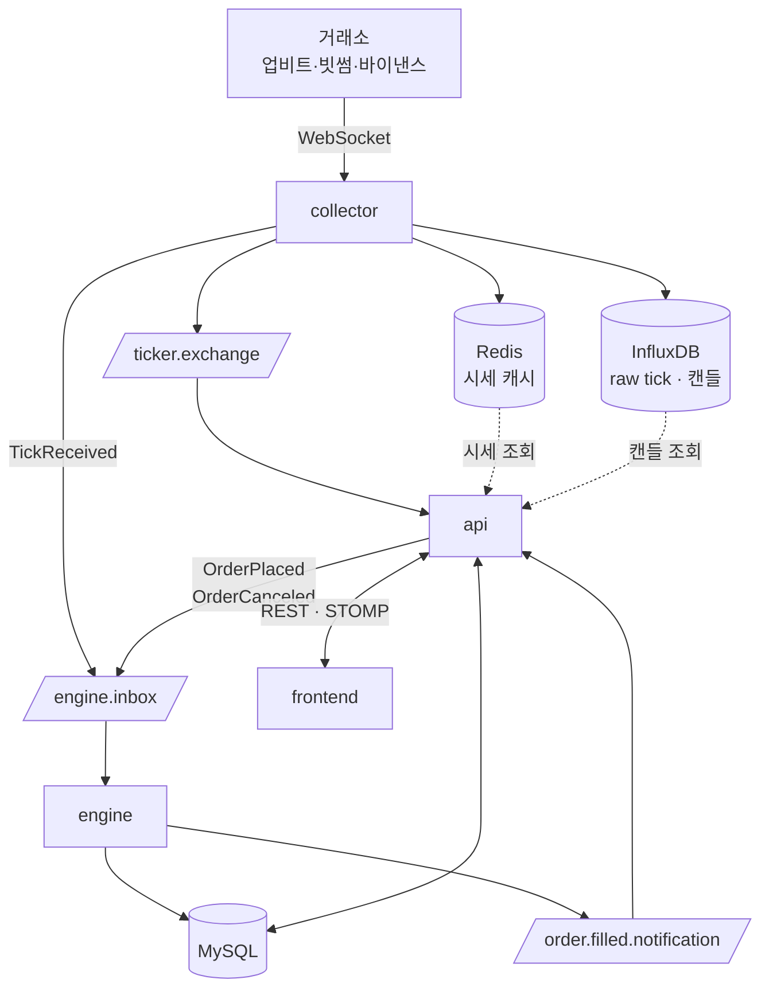

# 구성 요소

## 애플리케이션

| 서비스 | 역할 |
|--------|------|
| `collector` | 업비트·빗썸·바이낸스 WebSocket으로 시세를 수집·정규화하여 4곳으로 팬아웃 (Redis / InfluxDB / `ticker.exchange` / `engine.inbox`) |
| `api` | 사용자 요청을 REST·WebSocket(STOMP)로 처리. 모의 투자 핵심 비즈니스 로직과 보상 스케줄러를 보유 |
| `engine` | 단일 쓰기 스레드 매칭 엔진. 주문 장부를 유지하고 시세 틱에 따라 체결 |
| `frontend` | 사용자 UI 제공 |

## 인프라

| 인프라 | 용도 |
|------|------|
| MySQL | api·engine이 공유하는 단일 도메인 영속 저장소. api가 주 사용자이고, engine은 체결 처리 결과 기록용으로만 사용 |
| Redis | 시세 현재가·마켓 메타데이터 캐시. Redisson 분산 락 백엔드 |
| RabbitMQ | 서비스 간 메시지 브로커. 시세 유입 이벤트, 주문 이벤트, 체결 이벤트 전달 |
| InfluxDB | 시세 raw tick 적재. 서버사이드 Task가 캔들(1m/5m/1h…)로 집계 |
| Prometheus + Grafana + cAdvisor + node-exporter | 메트릭 수집·대시보드·컨테이너/호스트 모니터링 |

---

# 연결 관계

---

# 메시지 채널

서비스 간 통신은 RabbitMQ 3개 채널로 제한된다. 각 채널의 페이로드 스펙은 `docs/contracts/`에서 관리한다.

| 채널 | 종류 | 발행자 | 소비자 |
|------|------|--------|-------|
| `ticker.exchange` | Fanout Exchange | collector (`TickerEventPublisher`) | api (`LiveTickerEventListener`) |
| `engine.inbox` | Durable Queue | collector (`EngineInboxPublisher`) + api (`EngineInboxPublisher`) | engine (`RabbitIngress`) |
| `order.filled.notification` | Fanout Exchange | engine (`OutboxRelay`) | api (`EngineOrderFilledListener`) |

---

# 데이터 저장소 분담

| 저장소 | 누가 쓰나 | 용도                                                         |
|--------|-----------|------------------------------------------------------------|
| MySQL | api, engine | 핵심 도메인 데이터 저장소 (메인 DB) |
| Redis | collector, api | 거래소별 시세 현재가·마켓 메타 캐시. Redisson 분산 락은 collector 리더 선출에 사용 |
| InfluxDB | collector, api | raw 시세 tick을 시계열로 적재. InfluxDB 백그라운드 Task가 1m/5m/1h 캔들로 집계 |

---

# 핵심 흐름

- **시세 표시**: 거래소 → collector → ticker.exchange → api → STOMP → frontend
- **시세 기반 매칭**: 거래소 → collector → engine.inbox(TickReceived) → engine → 체결
- **주문**: frontend → api(검증·잔고차감·DB) → engine.inbox(OrderPlaced) → engine
- **체결 통지**: engine → outbox → order.filled.notification → api → STOMP
