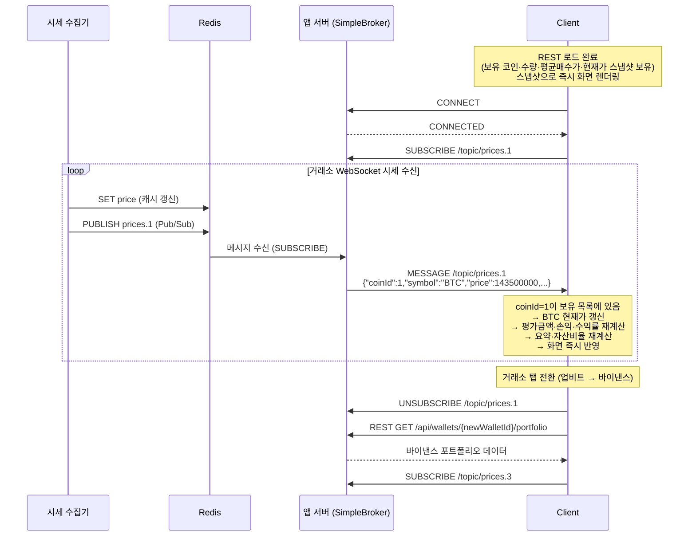

# 개요

거래소별 포트폴리오 투자 현황을 실시간으로 제공한다. REST API로 정적 데이터(보유 코인·잔고·평균매수가)를 로드하고, WebSocket으로 실시간 시세를 스트리밍하여 클라이언트가 평가금액·손익·수익률을 계산한다.

# 목적

- 사용자가 특정 거래소의 투자 현황을 한눈에 파악할 수 있도록 한다
- 보유 코인별 보유수량, 평균매수가, 현재가, 평가금액, 평가손익, 수익률을 실시간으로 보여준다
- 자산 구성 비율(도넛 차트)로 포트폴리오 분산도를 시각화한다

# 선행 구현 사항

- 지갑(Wallet): 라운드별 거래소 지갑이 생성되어 있어야 한다
- 잔고(WalletBalance): 기축통화 잔고가 관리되고 있어야 한다
- 보유 코인(Holding): 매수/매도 시 평균매수가, 보유수량이 갱신되어야 한다
- 시세(Redis): 코인 현재가가 Redis에 캐싱되어 있어야 한다
- WebSocket 인프라: STOMP + Redis Pub/Sub + SimpleBroker가 구성되어 있어야 한다 → [websocket.md](../websocket.md)

# 실시간 업데이트 전략

## REST + WebSocket 하이브리드

```
[1] 페이지 진입 → REST API로 초기 데이터 로드 (보유 코인, 수량, 평균매수가, 현재가 스냅샷)
[2] 초기 데이터 렌더링 → 현재가 스냅샷으로 평가금액·손익·수익률 계산 및 즉시 화면 표시
[3] WebSocket 연결 → /topic/prices.{exchangeId} 구독
[4] 시세 메시지 수신 → 클라이언트가 해당 코인의 평가금액·손익·수익률·비율 재계산
[5] 이후 시세 메시지 수신 → 재계산 반복
[6] 거래소 탭 전환 → 기존 구독 해제 + 새 거래소 REST 로드 + 새 구독
```

## 역할 분담

| 데이터 | 채널 | 제공 주체 | 비고 |
|--------|------|----------|------|
| 보유 코인 목록 | REST | 서버 | 정적 — 주문 체결 시에만 변경 |
| 보유수량·평균매수가 | REST | 서버 | 정적 — 주문 체결 시에만 변경 |
| 기축통화 잔고 | REST | 서버 | 정적 — 주문 체결 시에만 변경 |
| 현재가 스냅샷 | REST | 서버 | Redis 캐시에서 조회 — 초기 렌더용 |
| 현재가 실시간 | WebSocket | 서버 | 동적 — Redis Pub/Sub → SimpleBroker |
| 평가금액·손익·수익률 | — | 클라이언트 | 현재가 수신 시 계산 |
| 요약(총매수·총평가·총손익) | — | 클라이언트 | 현재가 수신 시 계산 |
| 자산 구성 비율 | — | 클라이언트 | 현재가 수신 시 계산 |

## 왜 서버가 아닌 클라이언트가 계산하는가

- 시세가 바뀔 때마다 서버에 요청하면 보유 코인 조회 + Redis 조회 + 계산이 반복되어 서버 부하가 높다
- 클라이언트는 이미 보유 코인·수량·평균매수가를 가지고 있으므로, 가격만 받으면 `수량 × 가격` 곱셈으로 즉시 계산할 수 있다
- 종목당 사칙연산 4회, 8종목이면 약 40회 — JavaScript에서 사실상 0ms
- 이는 업비트·바이낸스 등 실제 거래소의 구현 방식과 동일하다

# 입력 정보

## REST API (초기 로드)

- `userId` (Long): 사용자 ID
- `walletId` (Long): 조회할 지갑 ID (거래소별 지갑)

## WebSocket (실시간 갱신)

- 구독 토픽: `/topic/prices.{exchangeId}` — REST 응답의 거래소 정보로 결정

# 검증

| 항목 | 규칙 | 실패 시 에러 |
|------|------|-------------|
| 지갑 존재 | 해당 walletId의 지갑이 존재해야 한다 | `WALLET_NOT_FOUND` |
| 지갑 소유권 | 지갑의 소유자가 userId와 일치해야 한다 | `WALLET_NOT_OWNED` |

# 처리 로직 (REST 초기 로드)

서버는 정적 데이터와 현재가 스냅샷만 조회하여 반환한다. 파생값(평가금액, 손익, 수익률, 비중)은 계산하지 않는다.

1. 지갑을 조회하고 소유권을 검증한다
2. 거래소 정보를 조회하여 기축통화를 확인한다
3. 지갑의 기축통화(KRW 또는 USDT) 잔고를 조회한다
4. 지갑의 보유 코인(Holding) 목록을 조회한다 (보유수량 > 0)
5. 각 코인의 심볼·이름을 조회한다
6. 각 코인의 현재가를 Redis에서 조회한다 (초기 렌더용 스냅샷)
7. 결과를 조합하여 반환한다

## 정렬

- 서버는 정렬하지 않는다
- 클라이언트에서 코인명, 보유수량, 평균매수가, 현재가, 평가금액, 평가손익, 수익률 기준 정렬을 지원한다 (프론트엔드 정렬)

# 클라이언트 계산 명세

## 시세 수신 시 코인별 계산

WebSocket으로 특정 코인의 시세 메시지를 수신하면:

1. 해당 `coinId`의 `currentPrice`를 갱신한다
2. 해당 코인의 `valuationAmount = quantity × currentPrice`를 계산한다
3. 해당 코인의 `profitLoss = valuationAmount - (quantity × avgBuyPrice)`를 계산한다
4. 해당 코인의 `profitRate = (currentPrice - avgBuyPrice) / avgBuyPrice × 100`을 계산한다

## 요약 정보 계산

모든 보유 코인의 현재가가 1회 이상 수신되면:

- **총매수** = SUM(코인별 `quantity × avgBuyPrice`)
- **총평가** = SUM(코인별 `valuationAmount`)
- **총 보유자산** = `baseCurrencyBalance` + 총평가
- **평가손익** = 총평가 - 총매수
- **수익률** = 총매수가 0이면 0%, 아니면 (평가손익 / 총매수) × 100

## 자산 구성 비율 계산

- 기축통화 비율 = `baseCurrencyBalance` / 총 보유자산 × 100
- 코인별 비율 = 코인별 `valuationAmount` / 총 보유자산 × 100

> 보유수량·평균매수가·기축통화 잔고는 주문 체결 시에만 변한다. 주문 체결 후 사용자가 페이지를 새로고침하거나, 향후 주문 체결 알림(WebSocket) 수신 시 REST API를 재호출하여 동기화한다.

# 크로스 도메인 의존

| From → To | 참조 방식 | 용도 |
|-----------|----------|------|
| Portfolio → Wallet | PortfolioService → WalletService | 지갑 존재·소유권 확인, 거래소 ID 조회 |
| Portfolio → Wallet | PortfolioService → WalletService | 기축통화 잔고 조회 |
| Portfolio → Trading | PortfolioService → HoldingService | 보유 코인 목록 조회 |
| Portfolio → MarketData | PortfolioService → CoinService | 코인 심볼·이름 조회 |
| Portfolio → MarketData | PortfolioService → ExchangeService | 거래소 기축통화·ID 조회 |
| Portfolio → MarketData | PortfolioService → LivePriceService | 코인별 현재가 스냅샷 조회 (Redis) |

# API 명세

## 참고사항

- 거래소 탭(업비트/빗썸/바이낸스) 전환은 클라이언트가 walletId를 바꿔서 호출한다
- 정렬은 클라이언트에서 처리한다 (데이터량이 적으므로)

## REST API — 초기 로드

`GET /api/users/{userId}/wallets/{walletId}/portfolio`

### Path Parameters

| 필드 | 타입 | 필수 | 설명 |
|------|------|------|------|
| userId | Long | O | 사용자 ID |
| walletId | Long | O | 조회할 지갑 ID |

### Response

```json
{
  "status": 200,
  "code": "SUCCESS",
  "message": "포트폴리오를 조회했습니다.",
  "data": {
    "exchangeId": 1,
    "baseCurrencyBalance": 2450000,
    "baseCurrencySymbol": "KRW",
    "holdings": [
      {
        "coinId": 1,
        "coinSymbol": "BTC",
        "coinName": "비트코인",
        "quantity": 0.052341,
        "avgBuyPrice": 132500000,
        "currentPrice": 143250000
      },
      {
        "coinId": 2,
        "coinSymbol": "ETH",
        "coinName": "이더리움",
        "quantity": 1.245,
        "avgBuyPrice": 5120000,
        "currentPrice": 4821000
      }
    ]
  }
}
```

### 필드 설명

**data**

| 필드 | 타입 | 설명 |
|------|------|------|
| exchangeId | Long | 거래소 ID — WebSocket 구독 토픽에 사용 |
| baseCurrencyBalance | BigDecimal | 기축통화(KRW/USDT) 잔고 |
| baseCurrencySymbol | String | 기축통화 심볼 |

**holdings[]**

| 필드 | 타입 | 설명 |
|------|------|------|
| coinId | Long | 코인 ID — WebSocket 메시지의 coinId와 매칭 |
| coinSymbol | String | 코인 심볼 (BTC, ETH 등) |
| coinName | String | 코인 한국어명 (비트코인, 이더리움 등) |
| quantity | BigDecimal | 보유수량 |
| avgBuyPrice | BigDecimal | 평균매수가 |
| currentPrice | BigDecimal | 현재가 스냅샷 (Redis 시점) — 초기 렌더용, 이후 WebSocket으로 갱신 |

### 에러 응답

| code | status | 설명 |
|------|--------|------|
| WALLET_NOT_FOUND | 404 | 지갑을 찾을 수 없음 |
| WALLET_NOT_OWNED | 403 | 지갑 소유자가 아님 |

## WebSocket — 실시간 시세 구독

> WebSocket 연결, 인증, 하트비트, 재연결 등 인프라 상세는 [websocket.md](../websocket.md)를 참조한다.

### 구독 토픽

```
/topic/prices.{exchangeId}
```

- REST 응답의 `exchangeId`를 사용하여 구독한다
- 거래소 탭 전환 시 기존 구독 해제 → 새 REST 호출 → 새 토픽 구독

### 메시지 포맷

```json
{
  "coinId": 1,
  "symbol": "BTC",
  "price": 143250000,
  "changeRate": 2.3,
  "timestamp": 1709913600000
}
```

| 필드 | 타입 | 설명 |
|------|------|------|
| coinId | Long | 코인 ID — holdings의 coinId와 매칭 |
| symbol | String | 코인 심볼 |
| price | BigDecimal | 현재가 (거래소 기축통화 단위) |
| changeRate | BigDecimal | 등락률 (%) |
| timestamp | Long | 시세 수신 시각 (epoch ms) |

### 클라이언트 처리 흐름

1. 메시지의 `coinId`가 보유 코인 목록에 있는지 확인한다
2. 없으면 무시한다 (해당 거래소의 다른 코인 시세)
3. 있으면 해당 코인의 `currentPrice`를 갱신하고 평가금액·손익·수익률·비율을 재계산한다

# 시퀀스 다이어그램

## 초기 로드 (REST)

```mermaid
sequenceDiagram
    participant Client
    participant Controller as PortfolioController
    participant Service as PortfolioService
    participant WalletService
    participant ExchangeService
    participant HoldingService
    participant CoinService
    participant LivePriceService
    participant Redis
    participant MySQL

    Client->>Controller: GET /api/users/{userId}/wallets/{walletId}/portfolio
    Controller->>Service: getPortfolio(userId, walletId)

    rect rgb(60, 60, 60)
        Note over Service,MySQL: STEP 01 지갑 조회 및 소유권 검증
    end
    Service->>WalletService: getWallet(walletId)
    WalletService->>MySQL: SELECT wallet
    WalletService-->>Service: wallet
    Note over Service: 소유권 검증

    rect rgb(60, 60, 60)
        Note over Service,MySQL: STEP 02 거래소 기축통화 조회
    end
    Service->>ExchangeService: getExchangeDetail(exchangeId)
    ExchangeService->>MySQL: SELECT exchange
    ExchangeService-->>Service: exchange (baseCurrencyCoinId)

    rect rgb(60, 60, 60)
        Note over Service,MySQL: STEP 03 기축통화 잔고 조회
    end
    Service->>WalletService: getAvailableBalance(walletId, baseCurrencyCoinId)
    WalletService->>MySQL: SELECT available
    WalletService-->>Service: baseCurrencyBalance

    rect rgb(60, 60, 60)
        Note over Service,MySQL: STEP 04 보유 코인 목록 조회
    end
    Service->>HoldingService: findActiveHoldings(walletId)
    HoldingService->>MySQL: SELECT holdings WHERE quantity > 0
    HoldingService-->>Service: holdings

    rect rgb(60, 60, 60)
        Note over Service,MySQL: STEP 05 코인 심볼·이름 조회
    end
    Service->>CoinService: findCoins(coinIds)
    CoinService->>MySQL: SELECT coins
    CoinService-->>Service: coins (symbol, name)

    rect rgb(60, 60, 60)
        Note over Service,Redis: STEP 06 현재가 스냅샷 조회
    end
    Service->>LivePriceService: getLivePrices(exchangeCoinIds)
    LivePriceService->>Redis: MGET coin prices
    LivePriceService-->>Service: prices (초기 렌더용 스냅샷)

    Service-->>Controller: PortfolioResult
    Controller-->>Client: 200 OK
```



## 실시간 갱신 (WebSocket)


