# 개요

기간별(일간/주간/월간) 수익률 랭킹을 페이지네이션으로 조회한다.

# 선행 사항

> 수익률 계산, 참여 자격, 동률 처리, 갱신 주기, 배치 집계, RANKING 테이블 스키마는 [business-rules.md](./business-rules.md)를 참조한다.

# 입력 정보

- 기간(`period`): 일간/주간/월간 중 선택
- 페이지 번호(`page`): 0부터 시작
- 페이지 크기(`size`): 1~50, 기본값 20

# 검증

## 기간 검증

| 항목 | 규칙 |
|------|------|
| period | `DAILY`, `WEEKLY`, `MONTHLY` 중 하나여야 한다 |
| 유효하지 않은 값 | `INVALID_RANKING_PERIOD` 에러 반환 |

## 기준 날짜 결정

- `referenceDate` 파라미터가 없으면 해당 기간의 **최신 집계 날짜**를 사용한다
- `referenceDate` 파라미터가 있으면 해당 날짜의 집계 결과를 조회한다

# 처리 로직

1. `period`와 `referenceDate`로 RANKING 테이블에서 해당 기간의 랭킹 데이터를 조회한다
2. `rank` 오름차순으로 정렬하여 페이지네이션한다
3. 각 랭킹 항목에 유저의 닉네임을 함께 반환한다

## 조회 쿼리

```sql
SELECT r.rank, r.profit_rate, r.trade_count, u.nickname, r.user_id
FROM ranking r
JOIN user u ON r.user_id = u.user_id
WHERE r.period = :period
  AND r.reference_date = :referenceDate
ORDER BY r.rank ASC
LIMIT :size OFFSET :page * :size
```

# API 명세

## 참고사항

- 이 API는 읽기 전용 조회이다. 랭킹 데이터는 배치가 미리 집계해 둔 결과를 조회한다
- `referenceDate`를 생략하면 최신 집계 결과를 반환한다
- 닉네임은 `User` 테이블에서 조인하여 반환한다. 클라이언트가 별도 API를 호출할 필요 없다

`GET /api/rankings`

## Request Parameters (Query String)

| 필드 | 타입 | 필수 | 설명 |
|------|------|------|------|
| period | String | O | `DAILY` \| `WEEKLY` \| `MONTHLY` |
| referenceDate | String (yyyy-MM-dd) | X | 기준 날짜 (없으면 최신) |
| page | int | X | 페이지 번호 (기본값 0) |
| size | int | X | 페이지 크기 (기본값 20, 최대 50) |

## Request

```
GET /api/rankings?period=DAILY&page=0&size=20
```

## Response

```json
{
  "status": 200,
  "code": "SUCCESS",
  "message": "랭킹을 조회했습니다.",
  "data": {
    "page": 0,
    "size": 20,
    "totalPages": 5,
    "content": [
      {
        "rank": 1,
        "userId": 42,
        "nickname": "코인마스터",
        "profitRate": 15.23,
        "tradeCount": 12,
        "portfolioPublic": true
      },
      {
        "rank": 2,
        "userId": 17,
        "nickname": "홀드러",
        "profitRate": 12.87,
        "tradeCount": 5,
        "portfolioPublic": false
      },
      {
        "rank": 3,
        "userId": 88,
        "nickname": "스윙트레이더",
        "profitRate": 12.87,
        "tradeCount": 8,
        "portfolioPublic": true
      }
    ]
  }
}
```

## 에러 응답

| code | status | 설명 |
|------|--------|------|
| INVALID_RANKING_PERIOD | 400 | 유효하지 않은 기간 값 |
| RANKING_NOT_FOUND | 404 | 해당 기간의 랭킹 데이터가 없음 (배치 미실행) |

# 시퀀스 다이어그램

```mermaid
sequenceDiagram
    participant Client
    participant Controller as RankingController
    participant Service as GetRankingsService
    participant RankingAdapter as RankingPersistenceAdapter
    participant MySQL

    Client->>Controller: GET /api/rankings?period=DAILY&page=0&size=20
    Controller->>Service: getRankings(query)

    rect rgb(60, 60, 60)
        Note over Service,MySQL: STEP 01 기준 날짜 결정
    end
    alt referenceDate 파라미터 있음
        Note over Service: 전달받은 referenceDate 사용
    else referenceDate 파라미터 없음
        Service->>RankingAdapter: findLatestReferenceDate(period)
        RankingAdapter->>MySQL: SELECT MAX(reference_date)
        RankingAdapter-->>Service: latestDate
    end

    rect rgb(60, 60, 60)
        Note over Service,MySQL: STEP 02 랭킹 데이터 조회
    end
    Service->>RankingAdapter: findRankings(period, referenceDate, pageable)
    RankingAdapter->>MySQL: SELECT ranking JOIN user ORDER BY rank
    RankingAdapter-->>Service: Page<RankingResult>

    Service-->>Controller: Page<RankingResult>
    Controller-->>Client: 200 OK
```


