# 개요

지정가 주문이 생성되면 PENDING 상태로 대기한다. 실시간 시세가 체결 조건에 도달하면 해당 주문을 FILLED로 전이시키고 잔고를 반영한다. 이 과정을 "미체결 주문 매칭"이라 한다.

# 선행 구현 사항

- 지정가 주문 생성 (cex-order.md) — PENDING 상태 주문 생성, 잔고 lock 처리
- 실시간 시세 수집 (realtime-ticker.md) — 외부 시세 수집기가 Redis에 적재, RabbitMQ로 시세 변경 이벤트 발행

# 전체 흐름

```
[지정가 주문 생성]                    [시세 수신 및 이벤트 발행]
User → Nginx → Server A              시세 수집기 → Upbit/Bithumb/Binance WebSocket
                │                                    │
        MySQL에 PENDING 저장                   Redis에 현재가 갱신
                │                                    │
   Server A 로컬 캐시에 적재              RabbitMQ에 시세 변경 이벤트 발행
                                                     │
                                          Fanout → 모든 서버에 브로드캐스트
                                                     │
                                    ┌────────────────┼────────────────┐
                                Server A          Server B          Server C
                              (주문 있음)         (주문 없음)        (주문 없음)
                                    │                │                │
                          로컬 캐시에서          해당 코인 주문       해당 코인 주문
                          매칭 대상 조회          없음 → skip        없음 → skip
                                    │
                         체결 조건 충족 시
                              │
                    MySQL 주문 FILLED 변경
                    + 잔고 unlock → 반영
                    + Holding 갱신
                              │
                    로컬 캐시에서 제거
```

# 로컬 캐시 구조

## 적재 대상

PENDING 상태인 지정가 주문. 로컬 캐시에는 매칭 판정에 필요한 최소 정보만 적재한다.

## 캐시 키

`exchangeCoinId`(거래소-코인 ID)를 키로 사용한다. 시세 변경 이벤트 수신 시 해당 코인의 미체결 주문 리스트를 O(1)로 조회하기 위함이다.

## 자료구조

```
ConcurrentHashMap<Long, CopyOnWriteArrayList<PendingOrder>>
     exchangeCoinId →  해당 코인의 미체결 주문 리스트
```

- `ConcurrentHashMap`: 시세 이벤트 수신(읽기)과 주문 생성/취소(쓰기)가 동시에 발생하므로 thread-safe 자료구조 사용
- `CopyOnWriteArrayList`: 읽기(매칭 순회)가 쓰기(주문 추가/제거)보다 훨씬 빈번하므로 읽기 최적화된 자료구조 사용. 시세 이벤트마다 순회가 발생하지만 주문 추가/제거는 상대적으로 드물다

## PendingOrder (캐시 항목)

매칭 판정에 필요한 최소 정보만 보유한다. 체결 시 DB에서 전체 주문을 조회하여 처리한다.

| 필드 | 타입 | 설명 |
|------|------|------|
| orderId | Long | 주문 ID (DB PK) |
| exchangeCoinId | Long | 거래소-코인 ID |
| side | Side | BUY / SELL |
| price | BigDecimal | 지정가 |

## 캐시 생명주기

| 이벤트 | 캐시 동작 |
|--------|----------|
| 지정가 주문 생성 | DB 저장 후 로컬 캐시에 추가 |
| 매칭 체결 | 로컬 캐시에서 제거 |
| 주문 취소 | 로컬 캐시에서 제거 |
| 서버 재시작 | DB에서 전체 미체결 주문 워밍업 |

# 시세 변경 이벤트

## RabbitMQ 토폴로지

```
시세 수집기
    │
    ▼
[Fanout Exchange: ticker.exchange]
    │
    ├─→ Queue: ticker.matching.server-1  →  Server 1
    ├─→ Queue: ticker.matching.server-2  →  Server 2
    └─→ Queue: ticker.matching.server-3  →  Server 3
```

- **Fanout Exchange**: 모든 서버가 동일한 시세 이벤트를 수신해야 하므로 Fanout 사용
- **서버별 전용 큐**: 각 서버가 자기만의 큐를 가지며, 서버가 내려가면 큐에 메시지가 쌓이고 서버 복구 시 처리
- 기존 Redis Pub/Sub 기반 클라이언트 스트리밍 채널과는 별도의 경로

## 시세 변경 이벤트 메시지

| 필드 | 타입 | 설명 |
|------|------|------|
| exchangeCoinId | Long | 거래소-코인 ID |
| currentPrice | BigDecimal | 변경된 현재가 |
| timestamp | Long | 시세 수신 시각 (epoch ms) |

- `exchangeCoinId`를 포함해야 로컬 캐시에서 해당 코인의 미체결 주문을 즉시 조회할 수 있다
- 시세 수집기가 Redis 적재 시 `exchangeCoinId`를 알지 못하는 경우, 이벤트 수신 서버에서 `exchange + base/quote → exchangeCoinId` 매핑을 캐싱하여 변환한다

# 매칭 로직

## 체결 조건

| 주문 | 체결 조건 |
|------|----------|
| 지정가 매수 | 현재가 ≤ 지정가 |
| 지정가 매도 | 현재가 ≥ 지정가 |

## 매칭 플로우

```
시세 변경 이벤트 수신 (exchangeCoinId, currentPrice)
    │
    ▼
로컬 캐시에서 exchangeCoinId로 미체결 주문 리스트 조회
    │
    ▼
리스트가 비어있으면 → 종료 (대부분의 경우)
    │
    ▼
각 주문에 대해 체결 조건 판정 (인메모리 BigDecimal 비교)
    │
    ├─ 조건 미충족 → skip
    │
    └─ 조건 충족 → 체결 처리 (아래 단계)
         │
         ▼
    로컬 캐시에서 제거 (다음 시세 이벤트에서 중복 매칭 방지)
         │
         ▼
    비동기로 체결 처리 실행
```

## 체결 처리

체결 조건을 만족한 주문에 대해 다음을 수행한다.

### 1. 주문 상태 변경

- DB에서 주문을 조회한다
- 주문 상태를 PENDING → FILLED로 변경한다
- `filledAt`을 현재 시각으로 설정한다
- DB에 반영한다

### 2. 잔고 반영

주문 생성 시 lock된 잔고를 해제하고, 체결 결과를 반영한다.

| 주문 | lock 해제 | 체결 반영 |
|------|----------|----------|
| 지정가 매수 | 기준 통화 unlock (체결금액 + 수수료) | 기준 통화 deduct (체결금액 + 수수료) + 코인 add (체결수량) |
| 지정가 매도 | 코인 unlock (체결수량) | 코인 deduct (체결수량) + 기준 통화 add (체결금액 - 수수료) |

- unlock + deduct를 분리하는 이유: `available`과 `locked` 잔고를 명확하게 추적하기 위함
- 체결가는 지정가와 동일하다 (주문 생성 시 이미 계산된 `filledPrice` = `price`)

### 3. Holding 갱신

- 매수 체결: Holding의 평균 매수가, 보유 수량, 물타기 횟수를 갱신한다
- 매도 체결: Holding의 보유 수량을 감소시킨다. 전량 매도 시 0으로 리셋한다
- 기존 `Holding.applyOrder(side, filledPrice, quantity, currentPrice)` 메서드를 재사용한다

### 4. 클라이언트 체결 이벤트 발행

트랜잭션 커밋 후 STOMP를 통해 해당 사용자에게 체결 이벤트를 푸시한다.

- STOMP user destination: `/user/queue/events`
- 메시지: `{eventType: "ORDER_FILLED", walletId, orderId}`
- `@TransactionalEventListener(phase = AFTER_COMMIT)`으로 트랜잭션 커밋 후 발행한다
- 클라이언트는 현재 보고 있는 walletId와 일치할 때만 refetch한다
  - 포트폴리오 탭: 포트폴리오 API refetch (holdings + 잔고 변동)
  - 입출금 탭: 잔고 API refetch

## 트랜잭션 범위

하나의 체결 처리(주문 상태 변경 + 잔고 반영 + Holding 갱신)는 단일 트랜잭션으로 묶는다.

- 주문은 FILLED인데 잔고가 반영 안 된 상태를 방지
- 체결 처리 중 예외 발생 시 전체 롤백하고 로컬 캐시에 주문을 다시 추가한다
- 클라이언트 이벤트 발행은 트랜잭션 밖(AFTER_COMMIT)에서 수행하므로, 이벤트 발행 실패가 체결을 롤백하지 않는다

# 동시성 제어

## 정상 상태: 중복 체결 불가능

주문은 생성한 서버의 로컬 캐시에만 존재하므로, 여러 서버가 같은 주문을 동시에 매칭하는 상황 자체가 발생하지 않는다.

## 서버 재시작 시: DB 수준 방어

서버 재시작 시 DB에서 전체 미체결 주문을 워밍업하므로, 일시적으로 여러 서버에 같은 주문이 존재할 수 있다. 이때 DB 수준에서 중복 체결을 방어한다.

```sql
UPDATE orders SET status = 'FILLED', filled_at = ?
WHERE order_id = ? AND status = 'PENDING'
```

- `WHERE status = 'PENDING'` 조건으로 이미 체결된 주문은 영향 받지 않는다
- `affected rows = 0`이면 이미 체결된 것이므로 후속 처리를 skip하고 로컬 캐시에서만 제거한다
- 정상 상태에서는 이 방어 로직이 작동하지 않으므로 추가 I/O 없음

## 동일 서버 내 동시 매칭

빠르게 연속된 시세 이벤트가 같은 주문에 대해 동시에 체결 조건을 만족시킬 수 있다.

- 로컬 캐시에서 주문을 제거하는 시점을 체결 조건 판정 직후(DB 처리 전)로 설정한다
- 첫 번째 이벤트가 캐시에서 제거하면 두 번째 이벤트는 캐시에서 찾지 못해 skip된다
- 만약 체결 처리가 실패(예외)하면 캐시에 다시 추가한다

# 서버 재시작 워밍업

## 워밍업 시점

`ApplicationReadyEvent` 시점에 DB에서 PENDING 상태 주문을 조회하여 로컬 캐시에 적재한다. RabbitMQ 리스너는 워밍업 완료 후 시세 이벤트를 소비하기 시작한다.

## 워밍업 쿼리

```sql
SELECT order_id, exchange_coin_id, side, price
FROM orders
WHERE status = 'PENDING'
```

- 매칭 판정에 필요한 최소 컬럼만 조회한다
- 전체 미체결 주문을 한 번에 조회한다 (주문 수가 서버당 수천~수만 수준으로 관리 가능)

## 워밍업과 시세 이벤트 순서

1. 서버 시작
2. DB에서 미체결 주문 워밍업 → 로컬 캐시 적재
3. RabbitMQ 리스너 활성화 → 시세 이벤트 소비 시작

워밍업 중 들어온 시세 이벤트는 큐에 쌓여있다가 리스너 활성화 후 소비된다. 워밍업 전에 체결 조건에 도달했던 주문도 다음 시세 이벤트에서 매칭된다.

# 매칭 실패 및 예외 처리

| 상황 | 처리 |
|------|------|
| DB에서 주문 조회 실패 (삭제됨) | 로컬 캐시에서 제거, 로그 경고 |
| 이미 체결된 주문 (affected rows = 0) | 로컬 캐시에서 제거, 후속 처리 skip |
| 잔고 반영 실패 | 트랜잭션 롤백, 로컬 캐시에 주문 재추가, 다음 시세 이벤트에서 재시도 |
| RabbitMQ 연결 끊김 | 큐에 메시지 쌓임, 재연결 후 소비. 체결 지연 발생 |

# 헥사고날 아키텍처 매핑

## 도메인 변경

### Order 도메인 모델

기존 `Order`에 체결 관련 메서드를 추가한다.

| 메서드 | 설명 |
|--------|------|
| `fill(LocalDateTime now)` | PENDING → FILLED 전이, filledAt 설정 |
| `isMatchedAt(BigDecimal currentPrice)` | 체결 조건 판정 (매수: 현재가 ≤ 지정가, 매도: 현재가 ≥ 지정가) |
| `isPending()` | 상태가 PENDING인지 판별 |

### PendingOrder (도메인 VO)

매칭 판정에 필요한 최소 정보를 담는 불변 VO. 로컬 캐시 항목으로 사용된다.

```java
public record PendingOrder(
    Long orderId,
    Long exchangeCoinId,
    Side side,
    BigDecimal price
) {
    public boolean isMatchedAt(BigDecimal currentPrice) {
        return side == Side.BUY
            ? currentPrice.compareTo(price) <= 0
            : currentPrice.compareTo(price) >= 0;
    }
}
```

### PendingOrders (일급 컬렉션)

`exchangeCoinId`별 미체결 주문 리스트를 캡슐화한다.

```java
public class PendingOrders {
    private final CopyOnWriteArrayList<PendingOrder> orders;

    public List<PendingOrder> findMatchedOrders(BigDecimal currentPrice) { ... }
    public void add(PendingOrder order) { ... }
    public void remove(Long orderId) { ... }
    public boolean isEmpty() { ... }
}
```

## 포트

### Input Port (UseCase)

| UseCase | 메서드 | 호출 주체 |
|---------|-------|----------|
| `MatchPendingOrdersUseCase` | `matchOrders(Long exchangeCoinId, BigDecimal currentPrice)` | 시세 이벤트 리스너 (Adapter In) |

### Output Port

| Port | 메서드 | 설명 |
|------|-------|------|
| `OrderCommandPort` (기존) | `findById(Long)` | 체결 처리 시 주문 조회 |
| `OrderCommandPort` (기존) | `save(Order)` | 체결 후 주문 저장 |
| `OrderQueryPort` (신규) | `findAllPending()` | 워밍업 시 PENDING 주문 조회 |

- `findAllPending()`은 기존 `OrderCommandPort`에 추가하거나, 읽기 전용이므로 `OrderQueryPort`로 분리한다
- 워밍업용 조회는 `PendingOrder` VO를 반환한다 (매칭에 필요한 최소 컬럼만)

### Output Port (신규)

| Port | 메서드 | 설명 |
|------|-------|------|
| `OrderFilledEventPort` | `publish(Long userId, Long walletId, Long orderId)` | 체결 이벤트를 클라이언트에 발행 |

### 기존 크로스 컨텍스트 의존 (재사용)

| UseCase | 용도 |
|---------|------|
| `ManageWalletBalanceUseCase` | unlock + deduct + add 잔고 반영 |
| `FindExchangeCoinMappingUseCase` | exchangeCoinId → coinId 매핑 (Holding 갱신에 필요) |
| `FindExchangeDetailUseCase` | baseCurrencyCoinId 조회 (잔고 반영 대상 코인 식별) |
| `GetWalletOwnerIdUseCase` | walletId → userId 조회 (STOMP user destination 라우팅에 필요) |

## 어댑터

### Adapter In

| 어댑터 | 역할 |
|--------|------|
| `TickerEventListener` | RabbitMQ Fanout 큐에서 시세 변경 이벤트를 수신하여 `MatchPendingOrdersUseCase`를 호출 |

### Adapter Out

| 어댑터 | 역할 |
|--------|------|
| `OrderJpaPersistenceAdapter` (기존) | 주문 CRUD |
| `PendingOrderLocalCacheAdapter` (신규) | 로컬 캐시 관리 (ConcurrentHashMap). `PendingOrderCachePort`를 구현 |
| `OrderFilledStompAdapter` (신규) | `OrderFilledEventPort` 구현. `SimpMessagingTemplate.convertAndSendToUser()`로 STOMP 이벤트 발행 |

## 서비스

### MatchPendingOrdersService

`MatchPendingOrdersUseCase`를 구현한다. 순수 오케스트레이션만 수행한다.

```
matchOrders(exchangeCoinId, currentPrice)
    │
    ├─ PendingOrderCachePort에서 매칭 대상 조회
    │
    ├─ 각 매칭 주문에 대해:
    │   ├─ 캐시에서 즉시 제거
    │   └─ fillOrder(orderId, currentPrice) 호출
    │
    └─ 종료

fillOrder(orderId, currentPrice)  @Transactional
    │
    ├─ OrderCommandPort에서 주문 조회
    ├─ order.fill(now) — 상태 전이
    ├─ ManageWalletBalanceUseCase로 잔고 반영
    ├─ HoldingCommandPort로 Holding 갱신
    ├─ OrderCommandPort로 주문 저장
    └─ [AFTER_COMMIT] 클라이언트에 ORDER_FILLED 이벤트 발행
    │
    (실패 시 캐시에 다시 추가)
```

# 시퀀스 다이어그램

```mermaid
sequenceDiagram
    participant Ticker as 시세 수집기
    participant RabbitMQ
    participant Listener as TickerEventListener
    participant Service as MatchPendingOrdersService
    participant Cache as PendingOrderCachePort
    participant OrderPort as OrderCommandPort
    participant Balance as ManageWalletBalanceUseCase
    participant HoldingPort as HoldingCommandPort
    participant MySQL
    participant STOMP as SimpMessagingTemplate

    Note over Ticker,RabbitMQ: 시세 변경 이벤트 발행
    Ticker->>RabbitMQ: publish(exchangeCoinId, currentPrice)
    RabbitMQ->>Listener: consume (Fanout → 서버별 전용 큐)

    Listener->>Service: matchOrders(exchangeCoinId, currentPrice)

    rect rgb(60, 60, 60)
        Note over Service,Cache: STEP 01 매칭 대상 조회 (인메모리)
    end
    Service->>Cache: findMatchedOrders(exchangeCoinId, currentPrice)
    Cache-->>Service: List<PendingOrder>

    alt 매칭 대상 없음
        Note over Service: 종료 (I/O 없음)
    end

    loop 매칭된 주문마다
        rect rgb(60, 60, 60)
            Note over Service,Cache: STEP 02 캐시에서 즉시 제거
        end
        Service->>Cache: remove(orderId)

        rect rgb(60, 60, 60)
            Note over Service,MySQL: STEP 03 체결 처리 (@Transactional)
        end
        Service->>OrderPort: findById(orderId)
        OrderPort->>MySQL: SELECT order
        OrderPort-->>Service: Order

        Note over Service: order.fill(now)

        Service->>Balance: unlockBalance + deductBalance + addBalance
        Balance->>MySQL: UPDATE wallet_balance

        Service->>HoldingPort: findByWalletIdAndCoinId + save
        HoldingPort->>MySQL: SELECT + UPDATE holding

        Service->>OrderPort: save(order)
        OrderPort->>MySQL: UPDATE order (FILLED)

        rect rgb(60, 60, 60)
            Note over Service,STOMP: STEP 04 클라이언트 이벤트 (AFTER_COMMIT)
        end
        Service->>STOMP: convertAndSendToUser(userId, /queue/events, ORDER_FILLED)
    end

    Service-->>Listener: void
```



# 주문 생성 시 캐시 적재 연동

기존 `PlaceOrderService`에서 지정가 주문 생성 후 로컬 캐시에 적재하는 단계를 추가한다.

```
기존 STEP 08 (주문 저장) 이후:

    STEP 10 (신규) 로컬 캐시 적재 (지정가만)
    if order.status == PENDING:
        PendingOrderCachePort.add(PendingOrder.from(order))
```

- 트랜잭션 커밋 후 캐시에 적재한다 (DB 저장 실패 시 캐시에 유령 주문이 남는 것을 방지)
- `@TransactionalEventListener(phase = AFTER_COMMIT)`을 활용한다

# 주문 취소 시 캐시 제거 연동

기존 주문 취소 로직에서 로컬 캐시 제거를 추가한다.

```
주문 취소 처리 후:
    PendingOrderCachePort.remove(orderId)
```

- 캐시에 없는 주문을 제거하려 해도 예외 없이 무시한다 (다른 서버에서 생성된 주문일 수 있음)
